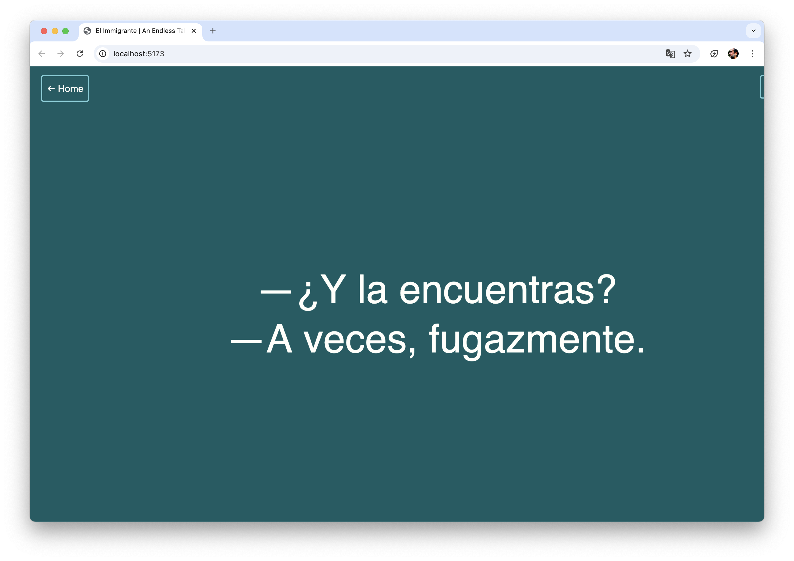

# El Inmigrante | An Endless Tale of Memory and Loss

An AI-powered interactive art installation that explores themes of memory, loss, and absence through generative dialogue and meditative visual poetry.





## 🎭 About

**El Inmigrante** is a contemplative digital installation that uses artificial intelligence to generate endless dialogues about memory and migration. Visitors experience a continuous cycle of AI-generated conversations that fade in and out like memories themselves, punctuated by a hypnotic spiral animation representing the passage of time.

The piece invites reflection on the immigrant experience, the fragility of memory, and the universal human themes of loss and longing.

## ✨ Experience Flow

1. **Landing Page**: Multilingual welcome with language selection
2. **Entry**: Beautiful spiral time animation (2 seconds)
3. **Memory Dialogues**: AI-generated conversations fade in and out (15-second cycles)
4. **Time Spirals**: Meditative animations between each dialogue (3 seconds)
5. **Infinite Loop**: Continuous generation of new memories

## 🎨 Visual Design

- **Minimalist Interface**: Clean, gallery-appropriate aesthetic
- **Smooth Transitions**: All elements fade in/out with easing functions
- **Perfect Centering**: Content positioned precisely in viewport center
- **Responsive Design**: Adapts to any screen size or orientation
- **Dark Theme**: Deep teal background with light text for contemplation

## 🤖 AI Integration

- **Model**: GPT-4 for nuanced, poetic dialogue generation
- **Prompts**: Culturally-specific prompts in Spanish and English
- **Format**: Dialogues formatted as conversational pairs with em-dashes
- **Filtering**: Automatic parsing to ensure proper dialogue structure

## 🛠 Technical Stack

- **Frontend**: Vanilla JavaScript with p5.js for graphics
- **Build Tool**: Vite for development and bundling
- **AI**: OpenAI API for text generation
- **Styling**: Custom CSS with modern layout techniques
- **Audio**: p5.sound for optional sound integration

## 🚀 Setup Instructions

### Prerequisites
- Node.js (v14 or higher)
- OpenAI API key

### Installation

1. **Clone or download** the project
2. **Install dependencies**:
   ```bash
   npm install
   ```

3. **Configure API Key**:
   Create a `.env` file in the root directory:
   ```env
   VITE_OPENAI_API_KEY=your_openai_api_key_here
   ```

4. **Start development server**:
   ```bash
   npm run dev
   ```

5. **Open** `http://localhost:5173` in your browser

### Production Build
```bash
npm run build
```

## 🎮 User Controls

- **Language Selection**: Choose Spanish or English prompts
- **Auto-Start**: Generation begins automatically after entering
- **Manual Generation**: Press `SPACE` to generate new dialogue
- **Performance Mode**: Press `P` to activate performance mode with language cycling and dark theme
- **Home**: Return to landing page anytime

### 🎭 Performance Mode

Press `P` to activate Performance Mode, designed for extended gallery presentations:

- **Automatic Language Cycling**: Rotates through all 20+ supported languages every 2-3 generations
- **Dark Theme**: Pure black background with white text for dramatic effect
- **Visual Indicator**: Shows current language and progress through language cycle
- **Same Animations**: All spiral animations remain visible and beautiful
- **Seamless Experience**: Maintains the same contemplative timing and fade effects

## 🌍 Multilingual Support

The installation supports **20+ languages** for truly global accessibility:

**European Languages**: Spanish, English, French, German, Italian, Portuguese, Russian, Greek, Turkish, Polish, Dutch, Swedish, Czech

**Asian Languages**: Japanese (日本語), Chinese (中文), Korean (한국어), Hindi (हिंदी), Thai (ไทย), Vietnamese (Tiếng Việt)

**Middle Eastern**: Arabic (العربية)

### Language Themes

Each language explores culturally-specific aspects of memory and migration:
- **Spanish (Español)**: Migration, nostalgia, and "el país que dejaste atrás" (the country you left behind)
- **English**: Universal themes of memory, loss, and the passage of time
- **Other Languages**: Adapted prompts that honor cultural nuances of memory and displacement

### Performance Mode Language Cycling

In Performance Mode, the installation automatically cycles through all supported languages, creating a polyglot meditation on the universal immigrant experience across cultures and borders.

## ⚡ Performance Notes

- **Optimized Rendering**: 60fps smooth animations
- **Memory Management**: Automatic cleanup of old dialogues
- **API Efficiency**: Thoughtful rate limiting and error handling
- **Cross-Browser**: Tested on modern browsers

## 🎨 Customization

### Visual Timing
Edit constants in `sketch.js`:
```javascript
const GENERATION_CYCLE = 15000; // Total dialogue duration
const FADE_IN_TIME = 2000;      // Fade in duration
const DISPLAY_TIME = 11000;     // Full visibility duration
const FADE_OUT_TIME = 2000;     // Fade out duration
```

### Color Scheme
Modify the `COLORS` object in `sketch.js` for different themes.

### AI Prompts
Update the `LANGUAGES` object to customize dialogue themes and styles.

## 🏛 Gallery Installation

This piece is designed for gallery or museum presentation:

- **Fullscreen Mode**: Optimized for immersive display
- **Touch/Click Interaction**: Accessible to all visitors
- **Multilingual**: Welcomes diverse audiences
- **Self-Running**: Continuous operation without supervision
- **Professional Aesthetic**: Clean, minimal interface

## 🔧 Troubleshooting

### Common Issues

**"API key missing" error**:
- Ensure `.env` file exists with correct `VITE_OPENAI_API_KEY`
- Restart development server after adding API key

**Text not generating**:
- Check browser console for API errors
- Verify OpenAI API key has sufficient credits
- Check internet connection

**Visual centering issues**:
- Clear browser cache
- Check for CSS conflicts if embedded in other sites

## 📄 License

This project is an art installation. Please respect the artistic intent and contact the creator for any commercial use or significant modifications.

## 🎪 Artist Statement

*El Inmigrante* emerges from a reflection on the digital age's relationship with memory and displacement. In our hyper-connected world, artificial intelligence becomes both a mirror and a mediator of human experience. 

The piece asks: Can machines understand loss? Can algorithms capture the nuance of longing? Through endless generated dialogues, visitors encounter not answers, but new questions about authenticity, memory, and what it means to be human in an age of artificial minds.

The spiral animation serves as a visual metaphor for time's passage—memories forming, crystallizing, then dissolving back into the digital ether from which they came.

---

*Created with ❤️ and 🤖 for those who carry memories across borders, both physical and digital.*